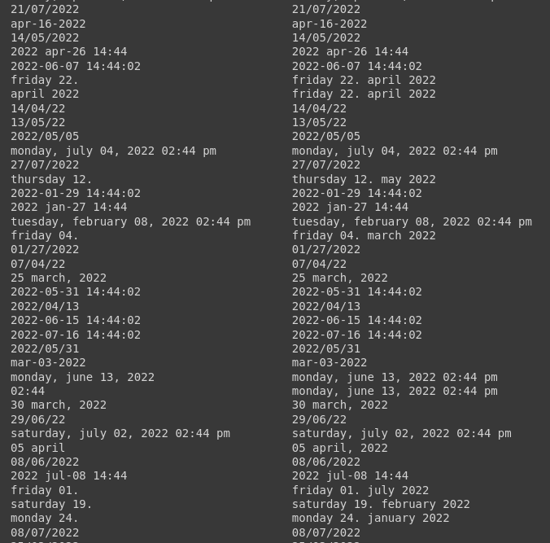

# Date-Entity-Recognition
## From a dataset of text, it will recognize different date-time format and predict its position in the corpus. It utilizes SpaCy "en_core_web_sm" model to finetune it for date entity.
```
pip3 install -r requirements.txt
python3 -m spacy download en_core_web_sm

python3 src/data/make_dataset.py
python3 src/models/make_model.py
```

## Predicted Date vs Actual Date

